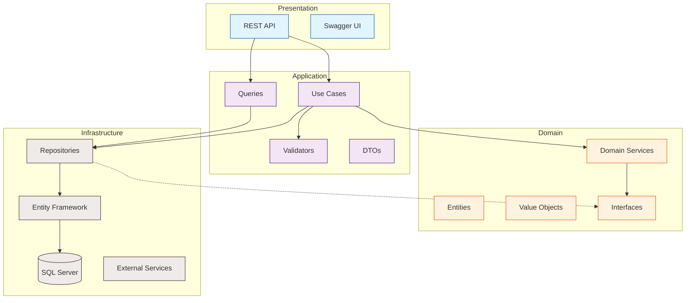

# VibraTicket - Documentação Técnica

<div align="center">


**Sistema completo de gerenciamento de eventos e venda de ingressos**

[Início](#) • [Arquitetura](./architecture/README.md) • [API](../Api/README.md) • [Guias](./guides/README.md)

</div>

---

## 📑 Índice

- [🏗️ Arquitetura](#️-arquitetura)
- [🔧 Tecnologias](#-tecnologias)
- [📂 Estrutura do Projeto](#-estrutura-do-projeto)
- [🚀 Começando](#-começando)
- [📖 Documentação Detalhada](#-documentação-detalhada)
- [🧪 Testes](#-testes)
- [📊 Métricas e Monitoramento](#-métricas-e-monitoramento)
- [🔒 Segurança](#-segurança)
- [🚢 Deploy](#-deploy)

## 🏗️ Arquitetura

O VibraTicket utiliza **Clean Architecture** com os seguintes princípios:

### Princípios Arquiteturais

- **Separação de Responsabilidades**: Cada camada tem sua responsabilidade específica
- **Inversão de Dependência**: As camadas internas não dependem das externas
- **Testabilidade**: Fácil criação de testes unitários e de integração
- **Manutenibilidade**: Código organizado e de fácil manutenção
- **Escalabilidade**: Preparado para crescer conforme a demanda

### Padrões Implementados

| Padrão | Descrição | Onde é usado |
|--------|-----------|--------------|
| **Clean Architecture** | Arquitetura em camadas com dependências unidirecionais | Todo o projeto |
| **CQRS** | Separação entre comandos e consultas | Application Layer |
| **Repository Pattern** | Abstração do acesso a dados | Infrastructure/Domain |
| **Unit of Work** | Gerenciamento de transações | Infrastructure |
| **Domain-Driven Design** | Modelagem focada no domínio | Domain Layer |
| **Dependency Injection** | Inversão de controle | Toda a aplicação |

### Diagrama de Arquitetura



## 🔧 Tecnologias

### Core Stack

| Tecnologia | Versão | Descrição |
|------------|--------|-----------|
| **.NET** | 8.0 | Framework principal |
| **Entity Framework Core** | 8.0 | ORM para acesso a dados |
| **SQL Server** | 2019+ | Banco de dados relacional |
| **FluentValidation** | 11.0+ | Validação de dados |
| **Swagger/OpenAPI** | 6.0+ | Documentação da API |

### Bibliotecas e Ferramentas

- **MediatR** - Implementação do padrão Mediator (opcional)
- **AutoMapper** - Mapeamento de objetos (opcional)
- **Serilog** - Logging estruturado
- **Polly** - Resiliência e tratamento de falhas
- **xUnit** - Framework de testes
- **Moq** - Mock objects para testes

## 📂 Estrutura do Projeto

```
VibraTicket/
├── docs/                       # Documentação do projeto
│   ├── architecture/          # Documentação de arquitetura
│   ├── api/                   # Documentação da API
│   ├── guides/                # Guias e tutoriais
│   └── diagrams/              # Diagramas e imagens
├── src/
│   ├── Domain/                # Camada de domínio
│   │   ├── Entities/         # Entidades de domínio
│   │   ├── ValueObjects/     # Objetos de valor
│   │   ├── Enums/           # Enumerações
│   │   └── Interfaces/      # Contratos do domínio
│   ├── Application/          # Camada de aplicação
│   │   ├── UseCases/        # Casos de uso (comandos)
│   │   ├── Queries/         # Consultas
│   │   ├── DTOs/           # Data Transfer Objects
│   │   ├── Validators/     # Validadores
│   │   └── Interfaces/     # Contratos da aplicação
│   ├── Infrastructure/      # Camada de infraestrutura
│   │   ├── Persistence/    # Configurações do EF Core
│   │   ├── Repositories/   # Implementação dos repositórios
│   │   ├── Migrations/     # Migrações do banco
│   │   └── Services/       # Serviços externos
│   └── Api/                # Camada de apresentação
│       ├── Controllers/    # Controllers REST
│       ├── Filters/       # Filtros customizados
│       ├── Middleware/    # Middleware customizado
│       └── Configuration/ # Configurações da API
└── tests/
    ├── Domain.Tests/      # Testes de domínio
    ├── Application.Tests/ # Testes de aplicação
    ├── Integration.Tests/ # Testes de integração
    └── Api.Tests/        # Testes da API
```

## 🚀 Começando

### Pré-requisitos

- [.NET 8 SDK](https://dotnet.microsoft.com/download)
- [SQL Server 2019+](https://www.microsoft.com/sql-server/)
- [Visual Studio 2022](https://visualstudio.microsoft.com/) ou [VS Code](https://code.visualstudio.com/)
- [Git](https://git-scm.com/)

### Instalação Rápida

```bash
# Clone o repositório
git clone https://github.com/seu-usuario/vibraticket.git
cd vibraticket

# Restaure as dependências
dotnet restore

# Configure o banco de dados
dotnet ef database update -p src/Infrastructure -s src/Api

# Execute a aplicação
dotnet run --project src/Api

# Acesse a documentação
open https://localhost:7001/swagger
```

### Configuração Detalhada

Consulte o [Guia de Instalação](./guides/installation.md) para instruções detalhadas.

## 📖 Documentação Detalhada

### 🏛️ [Arquitetura](./architecture/README.md)
- [Visão Geral das Camadas](./architecture/layers.md)
- [Modelo de Domínio](./architecture/domain-model.md)
- [Fluxo de Dados](./architecture/data-flow.md)
- [Decisões Arquiteturais](./architecture/decisions.md)

### 🔌 [API](./api/README.md)
- [Endpoints](./architecture/endpoints.md)
- [Autenticação e Autorização](./api/authentication.md)
- [Versionamento](./api/versioning.md)
- [Exemplos de Uso](./api/examples.md)

### 📚 [Guias](./guides/README.md)
- [Guia de Instalação](./guides/installation.md)
- [Guia de Desenvolvimento](./guides/development.md)
- [Guia de Contribuição](./guides/contributing.md)
- [Guia de Deploy](./guides/deployment.md)

### 🎯 [Domínio de Negócio](./domain/README.md)
- [Regras de Negócio](./domain/business-rules.md)
- [Fluxos de Negócio](./domain/business-flows.md)
- [Glossário](./domain/glossary.md)

## 🧪 Testes

O projeto inclui uma suite completa de testes:

### Tipos de Testes

| Tipo | Cobertura | Ferramenta |
|------|-----------|------------|
| **Unitários** | >80% | xUnit + Moq |
| **Integração** | Endpoints principais | xUnit + WebApplicationFactory |
| **E2E** | Fluxos críticos | Postman/Newman |

### Executando os Testes

```bash
# Todos os testes
dotnet test

# Testes específicos
dotnet test --filter "Category=Unit"
dotnet test --filter "Category=Integration"

# Com cobertura
dotnet test /p:CollectCoverage=true /p:CoverletOutputFormat=opencover
```

## 📊 Métricas e Monitoramento

### Health Checks

```http
GET /health          # Status geral
GET /health/ready    # Pronto para receber requisições
GET /health/live     # Aplicação está viva
```

### Métricas Disponíveis

- **Performance**: Tempo de resposta, throughput
- **Erros**: Taxa de erro, tipos de erro
- **Negócio**: Vendas, eventos criados, tickets vendidos
- **Infraestrutura**: CPU, memória, conexões de banco

### Integração com APM

- Application Insights
- Prometheus + Grafana
- ELK Stack (Elasticsearch, Logstash, Kibana)

## 🔒 Segurança

### Implementações de Segurança

- **Autenticação JWT**: Tokens seguros e com expiração
- **Autorização baseada em roles**: Controle de acesso granular
- **Rate Limiting**: Proteção contra abuso
- **CORS configurável**: Controle de origens permitidas
- **Validação de entrada**: Proteção contra SQL Injection e XSS
- **HTTPS obrigatório**: Comunicação criptografada

### Melhores Práticas

- Senhas hasheadas com BCrypt
- Princípio do menor privilégio
- Auditoria de ações sensíveis
- Segredos em variáveis de ambiente
- Atualização regular de dependências

## 🚢 Deploy

### Ambientes

| Ambiente | Propósito | URL |
|----------|-----------|-----|
| **Development** | Desenvolvimento local | https://localhost:7001 |
| **Staging** | Testes e homologação | https://staging.vibraticket.com |
| **Production** | Produção | https://api.vibraticket.com |

### Opções de Deploy

1. **Azure App Service** - PaaS recomendado
2. **Docker + Kubernetes** - Para alta escalabilidade
3. **IIS** - Deploy tradicional on-premise
4. **AWS/GCP** - Outras clouds

Consulte o [Guia de Deploy](./guides/deployment.md) para instruções detalhadas.

---

<div align="center">

📝 **Licença MIT** | 🤝 **Contribuições são bem-vindas!**

[Reportar Bug](https://github.com/seu-usuario/vibraticket/issues) • [Solicitar Feature](https://github.com/seu-usuario/vibraticket/issues)

</div>