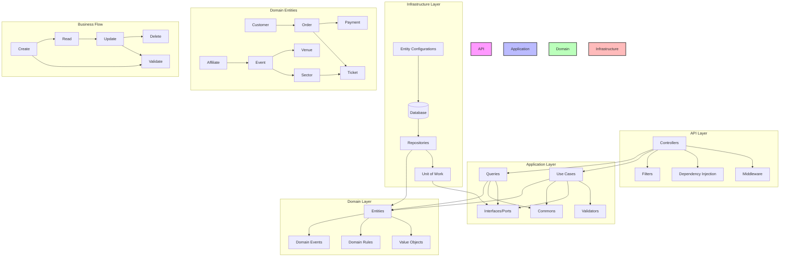

# Diagrama Técnico Detalhado



## Detalhes do Fluxo de Dados

1. **Request Flow**
   ```
   HTTP Request ? Controller ? Use Case ? Repository ? Database
   ```

2. **Response Flow**
   ```
   Database ? Repository ? Query ? DTO ? Controller ? HTTP Response
   ```

3. **Validation Flow**
   ```
   Input ? Validator ? Use Case ? Business Rules ? Result
   ```

## Estrutura de Camadas

### API Layer
- Controllers
- Filters
- Middleware
- DI Container
- Error Handling

### Application Layer
- Use Cases
- Queries
- Validators
- DTOs
- Interfaces
- Common Utils

### Domain Layer
- Entities
- Value Objects
- Domain Rules
- Events
- Interfaces

### Infrastructure Layer
- DbContext
- Repositories
- Configurations
- Unit of Work
- External Services

## Design Patterns Utilizados

1. **CQRS Pattern**
   - Commands (Use Cases)
   - Queries

2. **Repository Pattern**
   - Generic Repository
   - Specific Repositories

3. **Unit of Work**
   - Transaction Management
   - Change Tracking

4. **Factory Pattern**
   - Entity Creation
   - DTO Mapping

5. **Validator Pattern**
   - Input Validation
   - Business Rules

6. **Result Pattern**
   - Error Handling
   - Success/Failure