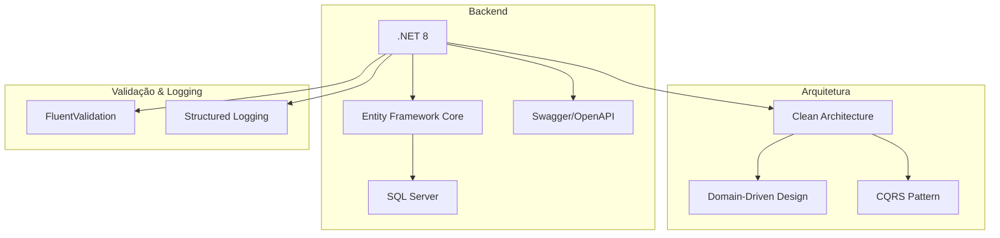

# Arquitetura do VibraTicket

Este diretório contém a documentação detalhada da arquitetura do sistema, dividida em seções específicas:

- [Visão Geral das Camadas](layers.md)
- [Endpoints da API](endpoints.md)
- [Fluxo de Dados](data-flow.md)
- [Modelo de Domínio](domain-model.md)

## Stack Tecnológico

