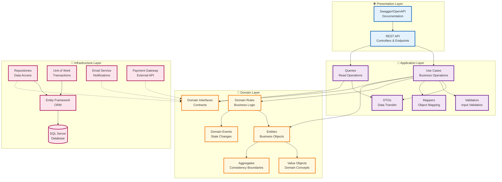
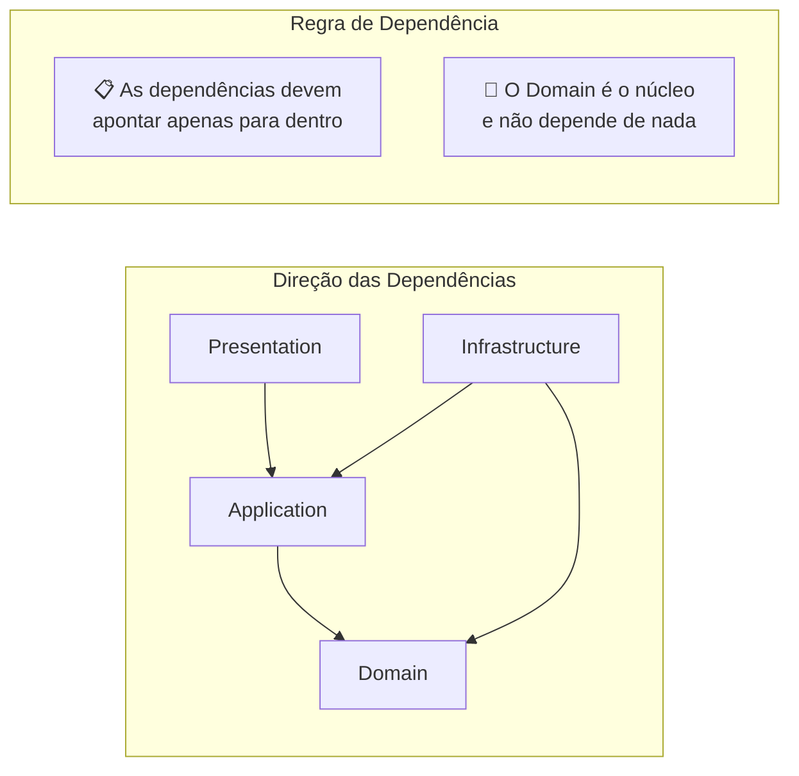
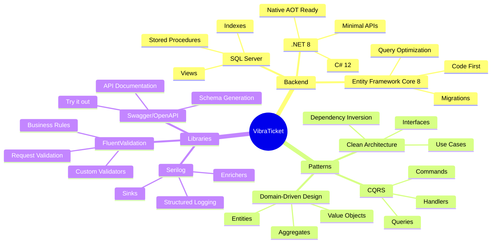
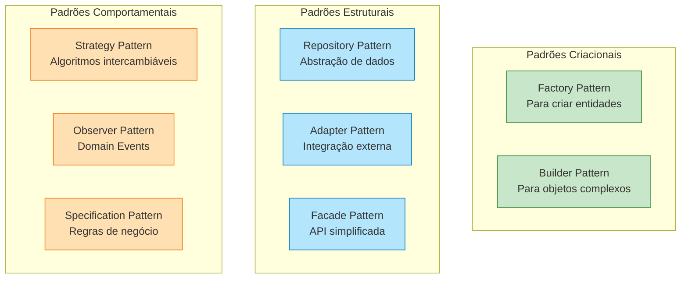
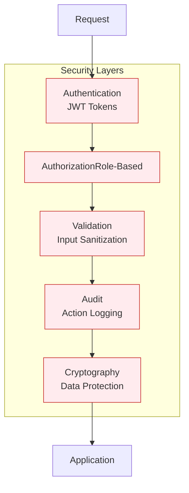
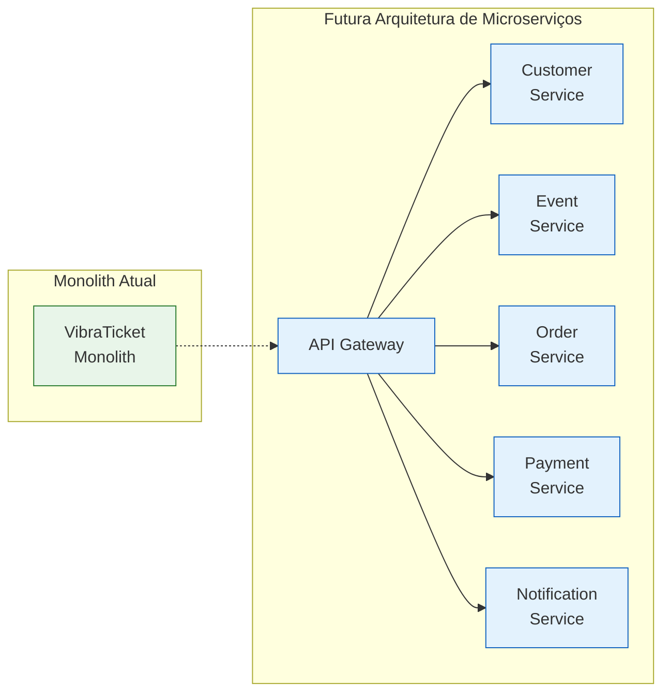

# 🏗️ Arquitetura do VibraTicket

## 📑 Índice de Documentação

| Documento | Descrição |
|-----------|-----------|
| 📐 [Camadas da Arquitetura](./layers.md) | Detalhamento de cada camada e suas responsabilidades |
| 🔄 [Fluxo de Dados](./data-flow.md) | Como os dados fluem através do sistema |
| 📊 [Modelo de Domínio](./domain-model.md) | Entidades e seus relacionamentos |
| 🔌 [Endpoints da API](./endpoints.md) | Mapeamento completo dos endpoints REST |
| 🎯 [Decisões Arquiteturais](./decisions.md) | ADRs e escolhas técnicas |
| 🔧 [Padrões e Práticas](./patterns.md) | Padrões de design implementados |

## 🎯 Visão Geral

O VibraTicket foi projetado seguindo os princípios de **Clean Architecture** (Arquitetura Limpa), garantindo:

- ✅ **Independência de Frameworks**: O núcleo da aplicação não depende de bibliotecas externas
- ✅ **Testabilidade**: Facilita a criação de testes em todos os níveis
- ✅ **Independência de UI**: A lógica de negócio não sabe como será apresentada
- ✅ **Independência de Banco de Dados**: Pode trocar de SQL Server para outro sem afetar o domínio
- ✅ **Independência de Agentes Externos**: Mudanças em APIs externas não afetam o núcleo

## 🏛️ Arquitetura em Camadas

## 🔄 Fluxo de Dependências

## 📊 Stack Tecnológico

## 🎨 Padrões e Princípios

### SOLID Principles

| Princípio | Aplicação no Projeto |
|-----------|---------------------|
| **S**ingle Responsibility | Cada classe tem apenas uma razão para mudar |
| **O**pen/Closed | Extensível sem modificar código existente |
| **L**iskov Substitution | Interfaces bem definidas e respeitadas |
| **I**nterface Segregation | Interfaces pequenas e específicas |
| **D**ependency Inversion | Dependências sempre apontam para abstrações |

### Design Patterns Implementados

## 🔒 Segurança em Camadas

## 📈 Escalabilidade

### Estratégias de Escalabilidade

- **Horizontal Scaling**: Aplicação stateless permite múltiplas instâncias
- **Database Scaling**: Read replicas e particionamento
- **Caching**: Redis para cache distribuído
- **Async Processing**: Filas para operações pesadas
- **CDN**: Para assets estáticos

### Preparação para Microserviços

O design modular permite fácil transição para microserviços:

## 📚 Referências e Leitura Adicional

### Livros
- **"Clean Architecture"** - Robert C. Martin
- **"Domain-Driven Design"** - Eric Evans
- **"Implementing Domain-Driven Design"** - Vaughn Vernon

### Artigos
- [Clean Architecture with .NET](https://docs.microsoft.com/clean-architecture)
- [CQRS Pattern](https://martinfowler.com/bliki/CQRS.html)
- [Repository Pattern Done Right](https://www.programmingwithwolfgang.com/repository-pattern-done-right/)

### Recursos Online
- [.NET Architecture Guides](https://dotnet.microsoft.com/learn/dotnet/architecture-guides)
- [Clean Architecture Solution Template](https://github.com/jasontaylordev/CleanArchitecture)

---

[← Voltar](../README.md) | [Próximo: Camadas →](./layers.md)

