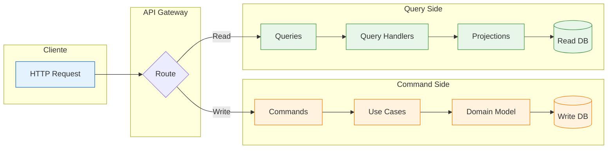
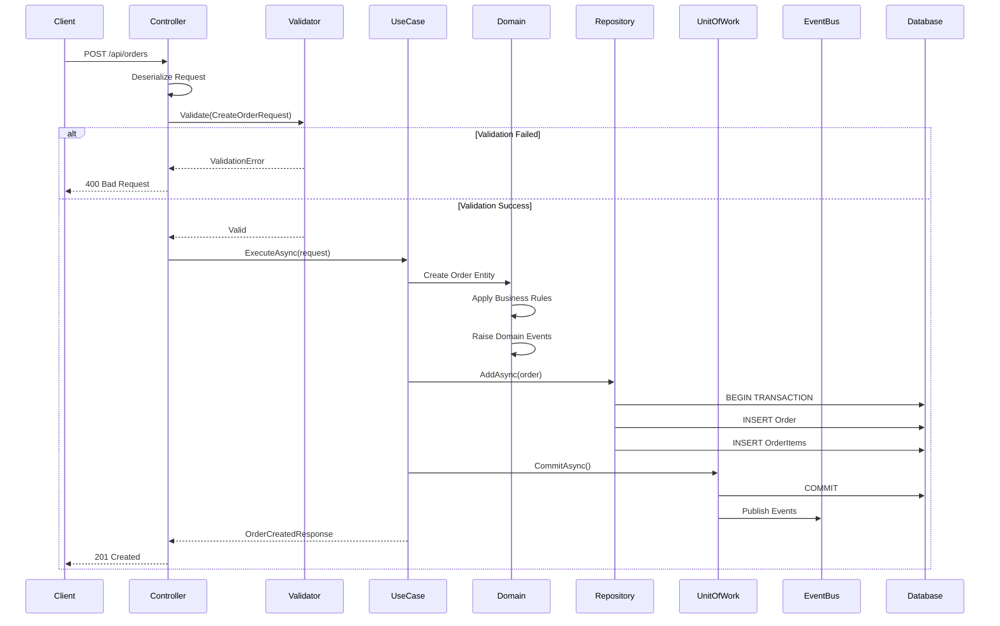
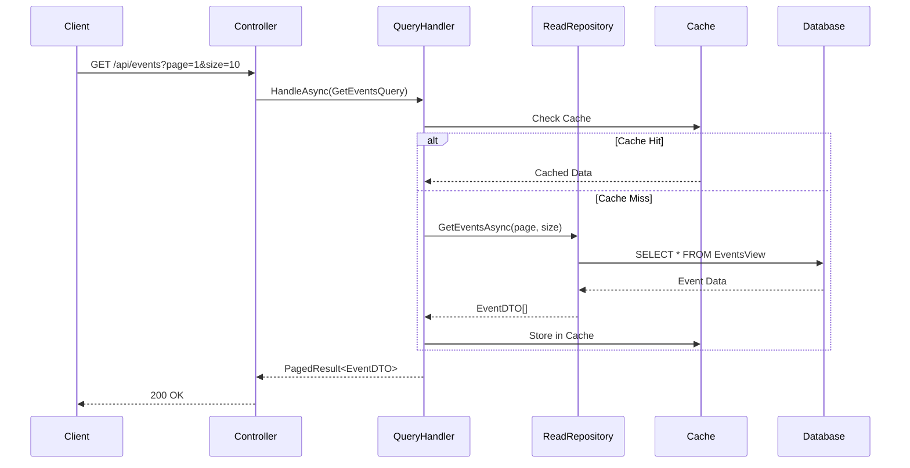
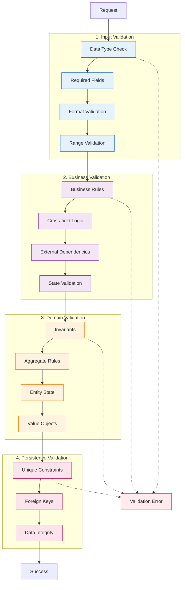
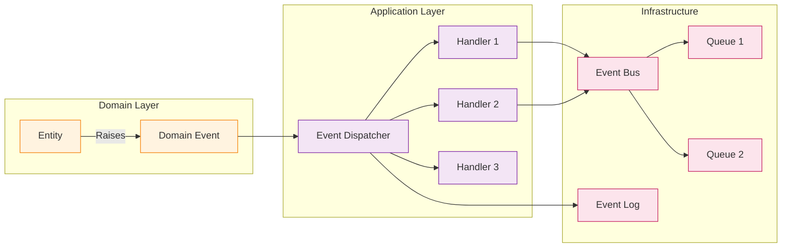
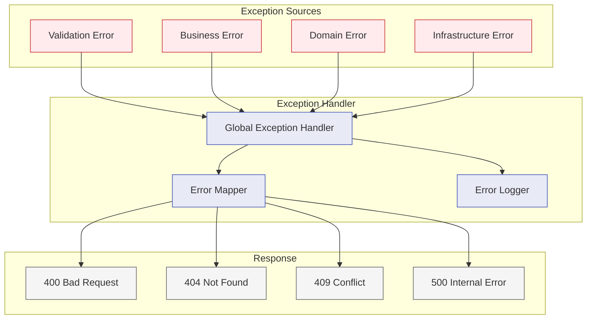
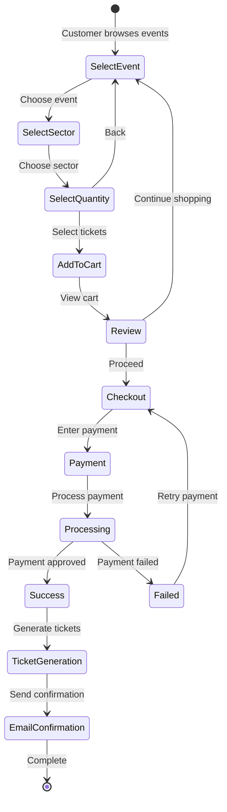

# 🔄 Fluxo de Dados

<div align="center">


</div>

## 📋 Índice

- [🎯 Visão Geral](#-visão-geral)
- [✍️ Fluxo de Escrita (Commands)](#️-fluxo-de-escrita-commands)
- [📖 Fluxo de Leitura (Queries)](#-fluxo-de-leitura-queries)
- [🔍 Fluxo de Validação](#-fluxo-de-validação)
- [⚡ Fluxo de Eventos](#-fluxo-de-eventos)
- [🔥 Tratamento de Erros](#-tratamento-de-erros)
- [📊 Exemplos Práticos](#-exemplos-práticos)

## 🎯 Visão Geral

O VibraTicket implementa **CQRS (Command Query Responsibility Segregation)** para separar operações de leitura e escrita, proporcionando:

- ✅ **Otimização independente** de leituras e escritas
- ✅ **Modelos específicos** para cada operação
- ✅ **Escalabilidade** diferenciada
- ✅ **Auditoria** simplificada
- ✅ **Performance** otimizada



## ✍️ Fluxo de Escrita (Commands)

### Sequência Detalhada



### Exemplo de Command Flow

```csharp
// 1️⃣ Controller recebe a requisição
[HttpPost]
public async Task<IActionResult> CreateOrder(CreateOrderRequest request)
{
    var result = await _createOrderUseCase.ExecuteAsync(request);
    return Created($"/api/orders/{result.Id}", result);
}

// 2️⃣ Use Case orquestra a operação
public async Task<OrderResponse> ExecuteAsync(CreateOrderRequest request)
{
    // Validação
    await _validator.ValidateAndThrowAsync(request);
    
    // Buscar dados necessários
    var customer = await _customerRepository.GetByIdAsync(request.CustomerId);
    if (customer == null)
        throw new NotFoundException("Customer not found");
    
    // Criar entidade aplicando regras de negócio
    var order = customer.PlaceOrder(request.Items.Select(i => 
        new OrderItem(i.ProductId, i.Quantity, i.Price)));
    
    // Persistir
    await _orderRepository.AddAsync(order);
    await _unitOfWork.CommitAsync();
    
    // Retornar response
    return _mapper.Map<OrderResponse>(order);
}

// 3️⃣ Domain aplica regras de negócio
public Order PlaceOrder(IEnumerable<OrderItem> items)
{
    if (Status != CustomerStatus.Active)
        throw new DomainException("Inactive customer cannot place orders");
        
    var order = new Order(this, items);
    
    // Raise domain event
    AddDomainEvent(new OrderPlacedEvent(order.Id, Id, order.Total));
    
    return order;
}
```

## 📖 Fluxo de Leitura (Queries)

### Sequência Otimizada



### Exemplo de Query Flow

```csharp
// 1️⃣ Controller
[HttpGet]
public async Task<IActionResult> GetEvents([FromQuery] GetEventsQuery query)
{
    var result = await _mediator.Send(query);
    return Ok(result);
}

// 2️⃣ Query Handler otimizado para leitura
public class GetEventsQueryHandler : IRequestHandler<GetEventsQuery, PagedResult<EventDTO>>
{
    private readonly IEventReadRepository _repository;
    private readonly IMemoryCache _cache;

    public async Task<PagedResult<EventDTO>> Handle(
        GetEventsQuery request, 
        CancellationToken cancellationToken)
    {
        var cacheKey = $"events_{request.Page}_{request.PageSize}_{request.Filter}";
        
        if (_cache.TryGetValue(cacheKey, out PagedResult<EventDTO> cached))
            return cached;
        
        var events = await _repository.GetPagedAsync(
            page: request.Page,
            pageSize: request.PageSize,
            filter: request.Filter,
            orderBy: request.OrderBy);
        
        _cache.Set(cacheKey, events, TimeSpan.FromMinutes(5));
        
        return events;
    }
}

// 3️⃣ Read Repository com query otimizada
public async Task<PagedResult<EventDTO>> GetPagedAsync(
    int page, int pageSize, string filter, string orderBy)
{
    var query = _context.Events
        .AsNoTracking()
        .Include(e => e.Venue)
        .Include(e => e.Sectors)
        .Where(e => e.IsActive);
    
    if (!string.IsNullOrEmpty(filter))
        query = query.Where(e => e.Name.Contains(filter));
    
    var total = await query.CountAsync();
    
    var items = await query
        .OrderBy(orderBy ?? "Name")
        .Skip((page - 1) * pageSize)
        .Take(pageSize)
        .Select(e => new EventDTO
        {
            Id = e.Id,
            Name = e.Name,
            Date = e.Date,
            VenueName = e.Venue.Name,
            TotalCapacity = e.Sectors.Sum(s => s.Capacity),
            AvailableTickets = e.Sectors.Sum(s => s.AvailableTickets)
        })
        .ToListAsync();
    
    return new PagedResult<EventDTO>(items, total, page, pageSize);
}
```

## 🔍 Fluxo de Validação

### Pipeline de Validação em Camadas



### Implementação de Validadores

```csharp
// 1️⃣ Input Validation (FluentValidation)
public class CreateEventValidator : AbstractValidator<CreateEventRequest>
{
    public CreateEventValidator()
    {
        RuleFor(x => x.Name)
            .NotEmpty().WithMessage("Event name is required")
            .MaximumLength(200).WithMessage("Event name too long");
        
        RuleFor(x => x.Date)
            .GreaterThan(DateTime.Now).WithMessage("Event must be in the future");
        
        RuleFor(x => x.VenueId)
            .NotEmpty().WithMessage("Venue is required");
        
        RuleFor(x => x.Sectors)
            .NotEmpty().WithMessage("At least one sector is required")
            .ForEach(sector => sector.SetValidator(new SectorValidator()));
    }
}

// 2️⃣ Business Validation (Use Case)
public class CreateEventUseCase
{
    public async Task<EventResponse> ExecuteAsync(CreateEventRequest request)
    {
        // Check venue availability
        var isVenueAvailable = await _venueService
            .IsAvailableAsync(request.VenueId, request.Date);
        
        if (!isVenueAvailable)
            throw new BusinessException("Venue is not available on this date");
        
        // Check affiliate permissions
        var affiliate = await _affiliateRepository.GetByIdAsync(request.AffiliateId);
        if (!affiliate.CanCreateEvents())
            throw new BusinessException("Affiliate cannot create events");
        
        // Continue with creation...
    }
}

// 3️⃣ Domain Validation (Entity)
public class Event : Entity
{
    public Event(string name, DateTime date, Venue venue, Affiliate affiliate)
    {
        // Domain invariants
        if (string.IsNullOrWhiteSpace(name))
            throw new DomainException("Event name cannot be empty");
        
        if (date <= DateTime.Now)
            throw new DomainException("Event date must be in the future");
        
        if (venue == null)
            throw new DomainException("Event must have a venue");
        
        if (!venue.IsActive)
            throw new DomainException("Cannot create event in inactive venue");
        
        Name = name;
        Date = date;
        Venue = venue;
        Affiliate = affiliate;
    }
}
```

## ⚡ Fluxo de Eventos

### Domain Events Pipeline



### Implementação de Eventos

```csharp
// 1️⃣ Domain Event
public class OrderPlacedEvent : DomainEvent
{
    public Guid OrderId { get; }
    public Guid CustomerId { get; }
    public decimal TotalAmount { get; }
    public DateTime PlacedAt { get; }

    public OrderPlacedEvent(Guid orderId, Guid customerId, decimal totalAmount)
    {
        OrderId = orderId;
        CustomerId = customerId;
        TotalAmount = totalAmount;
        PlacedAt = DateTime.UtcNow;
    }
}

// 2️⃣ Event Handler
public class OrderPlacedEventHandler : INotificationHandler<OrderPlacedEvent>
{
    private readonly IEmailService _emailService;
    private readonly IInventoryService _inventoryService;
    private readonly IAnalyticsService _analyticsService;

    public async Task Handle(OrderPlacedEvent notification, CancellationToken cancellationToken)
    {
        // Send confirmation email
        await _emailService.SendOrderConfirmationAsync(
            notification.CustomerId, 
            notification.OrderId);
        
        // Update inventory
        await _inventoryService.ReserveTicketsAsync(notification.OrderId);
        
        // Track analytics
        await _analyticsService.TrackOrderAsync(new OrderAnalytics
        {
            OrderId = notification.OrderId,
            Amount = notification.TotalAmount,
            Timestamp = notification.PlacedAt
        });
    }
}
```

## 🔥 Tratamento de Erros

### Fluxo de Exceções



### Global Exception Handler

```csharp
public class GlobalExceptionMiddleware
{
    private readonly RequestDelegate _next;
    private readonly ILogger<GlobalExceptionMiddleware> _logger;

    public async Task InvokeAsync(HttpContext context)
    {
        try
        {
            await _next(context);
        }
        catch (Exception ex)
        {
            await HandleExceptionAsync(context, ex);
        }
    }

    private async Task HandleExceptionAsync(HttpContext context, Exception exception)
    {
        _logger.LogError(exception, "An error occurred processing the request");

        var response = exception switch
        {
            ValidationException valEx => new ErrorResponse(
                StatusCodes.Status400BadRequest,
                "Validation failed",
                valEx.Errors.Select(e => new ErrorDetail(e.PropertyName, e.ErrorMessage))),
            
            NotFoundException notFound => new ErrorResponse(
                StatusCodes.Status404NotFound,
                notFound.Message),
            
            DomainException domain => new ErrorResponse(
                StatusCodes.Status409Conflict,
                domain.Message),
            
            _ => new ErrorResponse(
                StatusCodes.Status500InternalServerError,
                "An error occurred while processing your request")
        };

        context.Response.StatusCode = response.StatusCode;
        await context.Response.WriteAsJsonAsync(response);
    }
}
```

## 📊 Exemplos Práticos

### Fluxo Completo: Compra de Ingresso



### Código do Fluxo

```csharp
// 1️⃣ Select Event (Query)
public async Task<IEnumerable<EventListDTO>> GetAvailableEvents()
{
    return await _context.Events
        .Where(e => e.Date > DateTime.Now && e.HasAvailableTickets)
        .Select(e => new EventListDTO
        {
            Id = e.Id,
            Name = e.Name,
            Date = e.Date,
            Venue = e.Venue.Name,
            LowestPrice = e.Sectors.Min(s => s.Price),
            AvailableTickets = e.Sectors.Sum(s => s.AvailableTickets)
        })
        .ToListAsync();
}

// 2️⃣ Create Order (Command)
public async Task<OrderResponse> CreateOrder(CreateOrderRequest request)
{
    // Begin transaction
    using var transaction = await _unitOfWork.BeginTransactionAsync();
    
    try
    {
        // Create order
        var order = new Order(request.CustomerId);
        
        // Add items and validate availability
        foreach (var item in request.Items)
        {
            var sector = await _sectorRepository.GetByIdAsync(item.SectorId);
            if (!sector.HasAvailableTickets(item.Quantity))
                throw new BusinessException($"Not enough tickets in sector {sector.Name}");
            
            order.AddItem(sector, item.Quantity);
            sector.ReserveTickets(item.Quantity);
        }
        
        // Save order
        await _orderRepository.AddAsync(order);
        await _unitOfWork.CommitAsync();
        
        // Process payment
        var paymentResult = await _paymentService.ProcessAsync(order);
        
        if (paymentResult.IsSuccess)
        {
            order.ConfirmPayment(paymentResult.TransactionId);
            await _unitOfWork.CommitAsync();
            await transaction.CommitAsync();
            
            // Publish events
            await _eventBus.PublishAsync(new OrderCompletedEvent(order));
        }
        else
        {
            await transaction.RollbackAsync();
            throw new PaymentException(paymentResult.ErrorMessage);
        }
        
        return _mapper.Map<OrderResponse>(order);
    }
    catch
    {
        await transaction.RollbackAsync();
        throw;
    }
}
```

---

<div align="center">

[← Camadas](./layers.md) | [Próximo: Modelo de Domínio →](./domain-model.md)

</div>