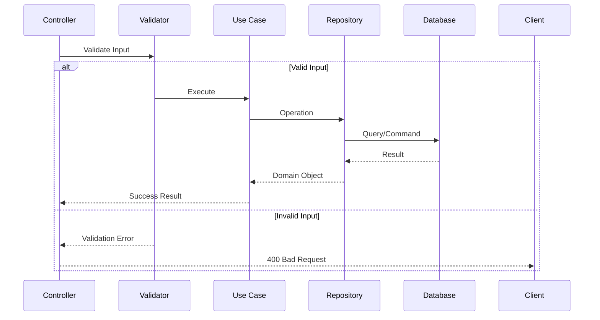
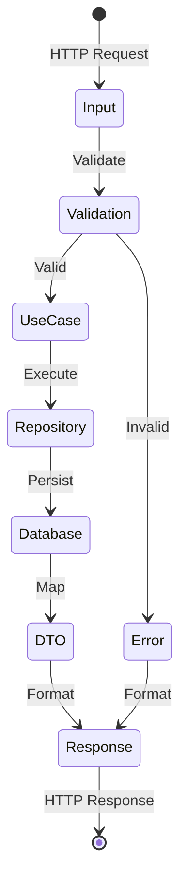

# Fluxo de Dados

## Fluxo CQRS

```mermaid
graph TD
    subgraph "Commands (Write Operations)"
        CQ[Client Request]
        CC[Controller]
        UC[Use Case]
        VAL[Validator]
        REP[Repository]
        DB[(Database)]

        CQ --> CC
        CC --> VAL
        VAL --> UC
        UC --> REP
        REP --> DB
    end

    subgraph "Queries (Read Operations)"
        CQR[Client Request]
        CQC[Controller]
        QH[Query Handler]
        QREP[Repository]
        QDB[(Database)]

        CQR --> CQC
        CQC --> QH
        QH --> QREP
        QREP --> QDB
    end

    classDef request fill:#f9f,stroke:#333,stroke-width:2px
    classDef process fill:#bbf,stroke:#333,stroke-width:2px
    classDef data fill:#bfb,stroke:#333,stroke-width:2px

    class CQ,CQR request
    class CC,UC,VAL,QH process
    class REP,DB,QREP,QDB data
```

## Fluxo de Validação

```mermaid
sequenceDiagram
    participant C as Controller
    participant V as Validator
    participant UC as Use Case
    participant R as Repository
    participant DB as Database

    C->>V: Validate Input
    
    alt Valid Input
        V->>UC: Execute
        UC->>R: Operation
        R->>DB: Query/Command
        DB-->>R: Result
        R-->>UC: Domain Object
        UC-->>C: Success Result
    else Invalid Input
        V-->>C: Validation Error
        C-->>Client: 400 Bad Request
    end
```

## Ciclo de Vida dos Dados

```mermaid
stateDiagram-v2
    [*] --> Input: HTTP Request
    Input --> Validation: Validate
    
    Validation --> UseCase: Valid
    Validation --> Error: Invalid
    
    UseCase --> Repository: Execute
    Repository --> Database: Persist
    
    Database --> DTO: Map
    DTO --> Response: Format
    
    Error --> Response: Format
    Response --> [*]: HTTP Response
```