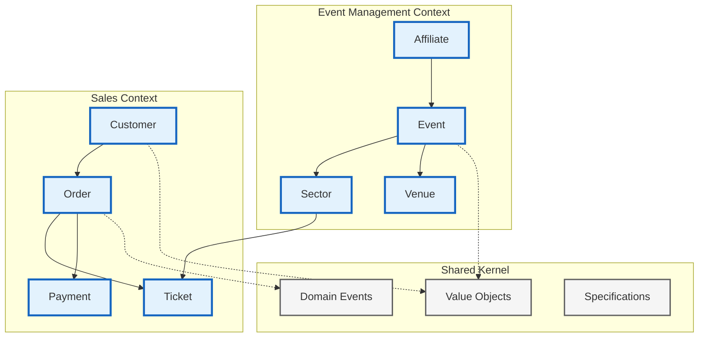
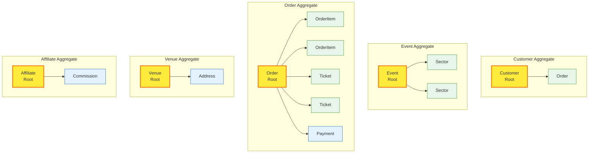
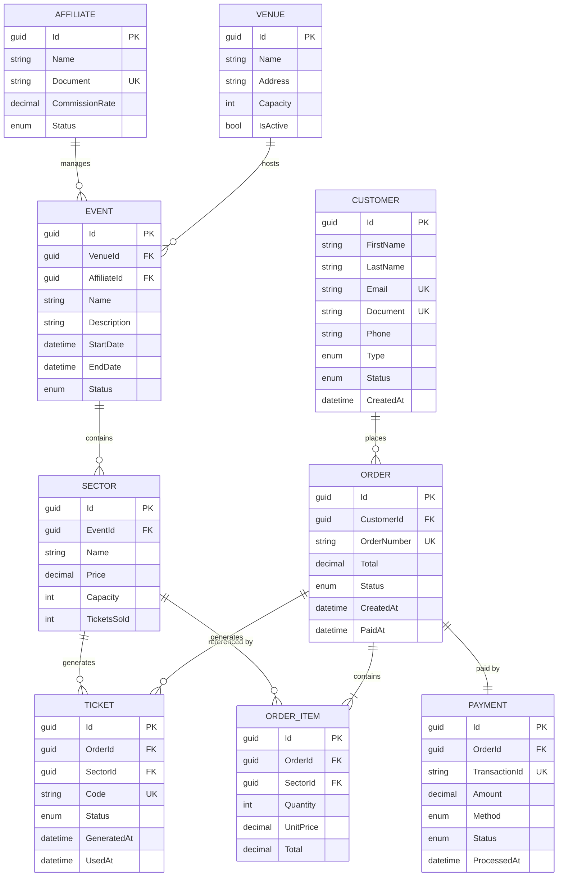
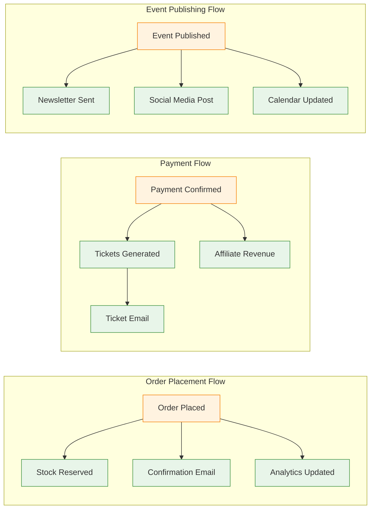

# 📊 Modelo de Domínio

<div align="center">


</div>

## 📑 Índice

- [🎯 Visão Geral](#-visão-geral)
- [🏛️ Entidades Principais](#️-entidades-principais)
- [💎 Value Objects](#-value-objects)
- [📦 Aggregates](#-aggregates)
- [🔗 Relacionamentos](#-relacionamentos)
- [📋 Regras de Negócio](#-regras-de-negócio)
- [⚡ Domain Events](#-domain-events)

## 🎯 Visão Geral

O modelo de domínio do VibraTicket representa o núcleo do sistema de gestão de eventos e venda de ingressos, implementando conceitos de Domain-Driven Design (DDD).

### Bounded Contexts



## 🏛️ Entidades Principais

### Customer (Cliente)

```csharp
public class Customer : Entity, IAggregateRoot
{
    // Properties
    public Name Name { get; private set; }
    public Email Email { get; private set; }
    public Document Document { get; private set; }
    public Phone Phone { get; private set; }
    public CustomerType Type { get; private set; }
    public CustomerStatus Status { get; private set; }
    public DateTime CreatedAt { get; private set; }
    
    // Collections
    private readonly List<Order> _orders = new();
    public IReadOnlyCollection<Order> Orders => _orders.AsReadOnly();
    
    // Business Logic
    public void UpdateProfile(Name name, Phone phone)
    {
        Name = name ?? throw new ArgumentNullException(nameof(name));
        Phone = phone ?? throw new ArgumentNullException(nameof(phone));
        
        AddDomainEvent(new CustomerUpdatedEvent(Id));
    }
    
    public Order PlaceOrder(IEnumerable<OrderItem> items)
    {
        if (Status != CustomerStatus.Active)
            throw new DomainException("Only active customers can place orders");
            
        var order = new Order(this, items);
        _orders.Add(order);
        
        AddDomainEvent(new OrderPlacedEvent(order.Id, Id));
        return order;
    }
}
```

### Event (Evento)

```csharp
public class Event : Entity, IAggregateRoot
{
    // Properties
    public string Name { get; private set; }
    public string Description { get; private set; }
    public DateTime StartDate { get; private set; }
    public DateTime EndDate { get; private set; }
    public EventStatus Status { get; private set; }
    public Venue Venue { get; private set; }
    public Affiliate Affiliate { get; private set; }
    
    // Collections
    private readonly List<Sector> _sectors = new();
    public IReadOnlyCollection<Sector> Sectors => _sectors.AsReadOnly();
    
    // Computed Properties
    public int TotalCapacity => _sectors.Sum(s => s.Capacity);
    public int TicketsSold => _sectors.Sum(s => s.TicketsSold);
    public int AvailableTickets => TotalCapacity - TicketsSold;
    public bool IsSoldOut => AvailableTickets == 0;
    
    // Business Logic
    public Sector AddSector(string name, decimal price, int capacity)
    {
        if (Status != EventStatus.Draft)
            throw new DomainException("Cannot add sectors to published event");
            
        var sector = new Sector(name, price, capacity, this);
        _sectors.Add(sector);
        
        AddDomainEvent(new SectorAddedEvent(Id, sector.Id));
        return sector;
    }
    
    public void Publish()
    {
        if (Status != EventStatus.Draft)
            throw new DomainException("Only draft events can be published");
            
        if (!_sectors.Any())
            throw new DomainException("Event must have at least one sector");
            
        Status = EventStatus.Published;
        AddDomainEvent(new EventPublishedEvent(Id));
    }
}
```

### Order (Pedido)

```csharp
public class Order : Entity, IAggregateRoot
{
    // Properties
    public string OrderNumber { get; private set; }
    public Customer Customer { get; private set; }
    public OrderStatus Status { get; private set; }
    public DateTime CreatedAt { get; private set; }
    public DateTime? PaidAt { get; private set; }
    public Payment Payment { get; private set; }
    
    // Collections
    private readonly List<OrderItem> _items = new();
    public IReadOnlyCollection<OrderItem> Items => _items.AsReadOnly();
    
    private readonly List<Ticket> _tickets = new();
    public IReadOnlyCollection<Ticket> Tickets => _tickets.AsReadOnly();
    
    // Computed Properties
    public decimal Subtotal => _items.Sum(i => i.Total);
    public decimal Tax => Subtotal * 0.1m; // 10% tax
    public decimal Total => Subtotal + Tax;
    
    // Business Logic
    public void AddItem(Sector sector, int quantity)
    {
        if (Status != OrderStatus.Pending)
            throw new DomainException("Cannot modify confirmed order");
            
        var existingItem = _items.FirstOrDefault(i => i.SectorId == sector.Id);
        
        if (existingItem != null)
        {
            existingItem.IncreaseQuantity(quantity);
        }
        else
        {
            var item = new OrderItem(sector, quantity);
            _items.Add(item);
        }
        
        AddDomainEvent(new OrderItemAddedEvent(Id, sector.Id, quantity));
    }
    
    public void ConfirmPayment(string transactionId)
    {
        if (Status != OrderStatus.Pending)
            throw new DomainException("Order is not pending payment");
            
        Payment = new Payment(transactionId, Total, PaymentMethod.CreditCard);
        Status = OrderStatus.Paid;
        PaidAt = DateTime.UtcNow;
        
        GenerateTickets();
        
        AddDomainEvent(new OrderPaidEvent(Id, Customer.Id, Total));
    }
    
    private void GenerateTickets()
    {
        foreach (var item in _items)
        {
            for (int i = 0; i < item.Quantity; i++)
            {
                var ticket = new Ticket(item.Sector, this);
                _tickets.Add(ticket);
            }
        }
    }
}
```

## 💎 Value Objects

### Name (Nome)

```csharp
public class Name : ValueObject
{
    public string FirstName { get; }
    public string LastName { get; }
    public string FullName => $"{FirstName} {LastName}";

    public Name(string firstName, string lastName)
    {
        FirstName = firstName?.Trim() ?? throw new ArgumentNullException(nameof(firstName));
        LastName = lastName?.Trim() ?? throw new ArgumentNullException(nameof(lastName));

        if (FirstName.Length < 2)
            throw new DomainException("First name must have at least 2 characters");
            
        if (LastName.Length < 2)
            throw new DomainException("Last name must have at least 2 characters");
    }

    protected override IEnumerable<object> GetEqualityComponents()
    {
        yield return FirstName.ToLower();
        yield return LastName.ToLower();
    }
}
```

### Email

```csharp
public class Email : ValueObject
{
    private static readonly Regex EmailRegex = new(
        @"^[^@\s]+@[^@\s]+\.[^@\s]+$",
        RegexOptions.Compiled | RegexOptions.IgnoreCase);

    public string Value { get; }

    public Email(string value)
    {
        if (string.IsNullOrWhiteSpace(value))
            throw new DomainException("Email cannot be empty");

        if (!EmailRegex.IsMatch(value))
            throw new DomainException("Invalid email format");

        Value = value.ToLowerInvariant();
    }

    protected override IEnumerable<object> GetEqualityComponents()
    {
        yield return Value;
    }

    public static implicit operator string(Email email) => email?.Value;
    public override string ToString() => Value;
}
```

### Document (CPF/CNPJ)

```csharp
public class Document : ValueObject
{
    public string Value { get; }
    public DocumentType Type { get; }

    public Document(string value)
    {
        if (string.IsNullOrWhiteSpace(value))
            throw new DomainException("Document cannot be empty");

        value = value.Replace(".", "").Replace("-", "").Replace("/", "");

        if (value.Length == 11)
        {
            if (!IsValidCPF(value))
                throw new DomainException("Invalid CPF");
            Type = DocumentType.CPF;
        }
        else if (value.Length == 14)
        {
            if (!IsValidCNPJ(value))
                throw new DomainException("Invalid CNPJ");
            Type = DocumentType.CNPJ;
        }
        else
        {
            throw new DomainException("Invalid document format");
        }

        Value = value;
    }

    private static bool IsValidCPF(string cpf) { /* validation logic */ }
    private static bool IsValidCNPJ(string cnpj) { /* validation logic */ }

    protected override IEnumerable<object> GetEqualityComponents()
    {
        yield return Value;
    }
}
```

### Money

```csharp
public class Money : ValueObject
{
    public decimal Amount { get; }
    public string Currency { get; }

    public Money(decimal amount, string currency = "BRL")
    {
        if (amount < 0)
            throw new DomainException("Amount cannot be negative");

        if (string.IsNullOrWhiteSpace(currency))
            throw new DomainException("Currency is required");

        Amount = Math.Round(amount, 2);
        Currency = currency.ToUpperInvariant();
    }

    public Money Add(Money other)
    {
        if (Currency != other.Currency)
            throw new DomainException("Cannot add different currencies");

        return new Money(Amount + other.Amount, Currency);
    }

    public Money Multiply(int quantity)
    {
        return new Money(Amount * quantity, Currency);
    }

    protected override IEnumerable<object> GetEqualityComponents()
    {
        yield return Amount;
        yield return Currency;
    }

    public override string ToString() => $"{Currency} {Amount:N2}";
}
```

## 📦 Aggregates

### Diagrama de Agregados



### Regras de Agregados

1. **Consistência Transacional**: Todas as mudanças dentro de um agregado são salvas atomicamente
2. **Referências Externas**: Agregados só referenciam outros agregados por ID
3. **Invariantes**: Cada agregado mantém suas próprias invariantes válidas
4. **Eventos**: Agregados publicam eventos de domínio para comunicação

## 🔗 Relacionamentos

### Diagrama ER Completo



## 📋 Regras de Negócio

### Customer Rules

| Regra | Descrição | Implementação |
|-------|-----------|---------------|
| **R01** | Cliente deve ter documento válido (CPF/CNPJ) | Value Object Document |
| **R02** | Email deve ser único no sistema | Unique constraint |
| **R03** | Apenas clientes ativos podem fazer pedidos | Validação no PlaceOrder() |
| **R04** | Cliente PJ tem desconto de 10% | Cálculo no Order |

### Event Rules

| Regra | Descrição | Implementação |
|-------|-----------|---------------|
| **R05** | Evento deve ter pelo menos 1 setor | Validação no Publish() |
| **R06** | Não pode alterar evento após publicação | Status check |
| **R07** | Data do evento deve ser futura | Validação no construtor |
| **R08** | Capacidade total = soma dos setores | Computed property |

### Order Rules

| Regra | Descrição | Implementação |
|-------|-----------|---------------|
| **R09** | Máximo 10 ingressos por pedido | Validação no AddItem() |
| **R10** | Pedido expira em 15 minutos | Background job |
| **R11** | Não pode alterar pedido pago | Status check |
| **R12** | Gerar ingressos após pagamento | ConfirmPayment() |

### Ticket Rules

| Regra | Descrição | Implementação |
|-------|-----------|---------------|
| **R13** | Código do ingresso deve ser único | Generated UUID |
| **R14** | Ingresso usado não pode ser reutilizado | Status validation |
| **R15** | Validar ingresso no evento | QR Code + API |

## ⚡ Domain Events

### Catálogo de Eventos

```csharp
// Customer Events
public record CustomerCreatedEvent(Guid CustomerId, string Email) : DomainEvent;
public record CustomerUpdatedEvent(Guid CustomerId) : DomainEvent;
public record CustomerActivatedEvent(Guid CustomerId) : DomainEvent;
public record CustomerDeactivatedEvent(Guid CustomerId) : DomainEvent;

// Event Events (pun intended 😄)
public record EventCreatedEvent(Guid EventId, string Name, DateTime Date) : DomainEvent;
public record EventPublishedEvent(Guid EventId) : DomainEvent;
public record EventCanceledEvent(Guid EventId, string Reason) : DomainEvent;
public record SectorAddedEvent(Guid EventId, Guid SectorId) : DomainEvent;

// Order Events
public record OrderPlacedEvent(Guid OrderId, Guid CustomerId) : DomainEvent;
public record OrderItemAddedEvent(Guid OrderId, Guid SectorId, int Quantity) : DomainEvent;
public record OrderPaidEvent(Guid OrderId, Guid CustomerId, decimal Amount) : DomainEvent;
public record OrderCanceledEvent(Guid OrderId, string Reason) : DomainEvent;
public record OrderExpiredEvent(Guid OrderId) : DomainEvent;

// Ticket Events
public record TicketGeneratedEvent(Guid TicketId, Guid OrderId, string Code) : DomainEvent;
public record TicketUsedEvent(Guid TicketId, DateTime UsedAt) : DomainEvent;
public record TicketTransferredEvent(Guid TicketId, Guid FromCustomer, Guid ToCustomer) : DomainEvent;
```

### Event Flow



---

<div align="center">

[← Fluxo de Dados](./data-flow.md) | [Próximo: Endpoints →](./endpoints.md)

</div>