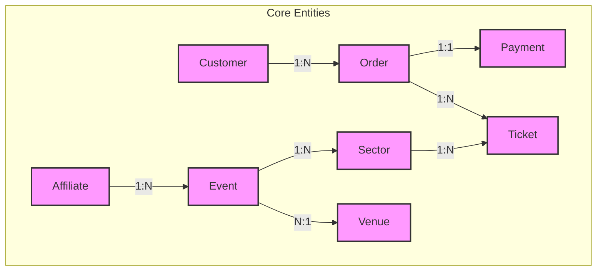
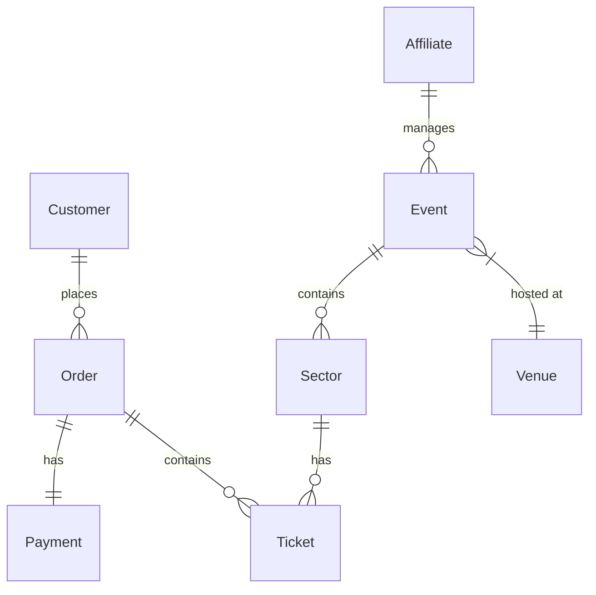
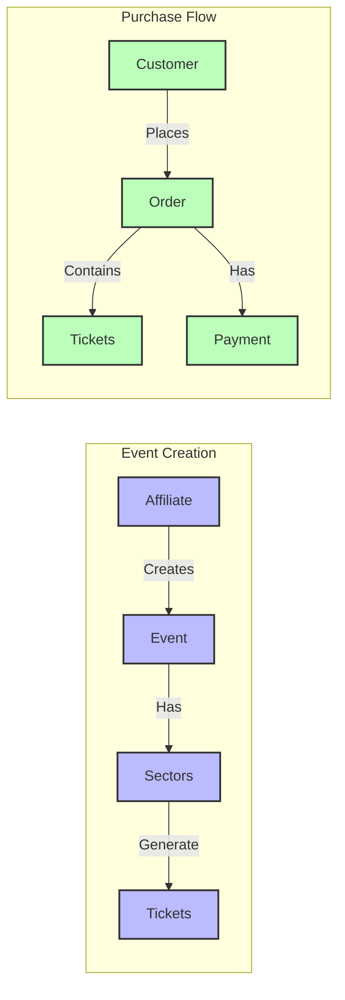

# Modelo de Domínio

## Diagrama de Entidades

```mermaid
graph TD
    subgraph "Core Entities"
        C[Customer]
        A[Affiliate]
        E[Event]
        S[Sector]
        T[Ticket]
        O[Order]
        P[Payment]
        V[Venue]
    end

    C -->|1:N| O
    O -->|1:1| P
    O -->|1:N| T
    E -->|1:N| S
    S -->|1:N| T
    E -->|N:1| V
    A -->|1:N| E

    classDef entity fill:#f9f,stroke:#333,stroke-width:2px
    class C,A,E,S,T,O,P,V entity
```

## Relacionamentos Detalhados

```mermaid
erDiagram
    Customer ||--o{ Order : places
    Order ||--|| Payment : has
    Order ||--o{ Ticket : contains
    Event ||--o{ Sector : contains
    Sector ||--o{ Ticket : has
    Event }|--|| Venue : "hosted at"
    Affiliate ||--o{ Event : manages
```

## Fluxo de Negócio

```mermaid
graph LR
    subgraph "Event Creation"
        A[Affiliate] -->|Creates| E[Event]
        E -->|Has| S[Sectors]
        S -->|Generate| T[Tickets]
    end

    subgraph "Purchase Flow"
        C[Customer] -->|Places| O[Order]
        O -->|Contains| TK[Tickets]
        O -->|Has| P[Payment]
    end

    classDef creation fill:#bbf,stroke:#333,stroke-width:2px
    classDef purchase fill:#bfb,stroke:#333,stroke-width:2px

    class A,E,S,T creation
    class C,O,TK,P purchase
```