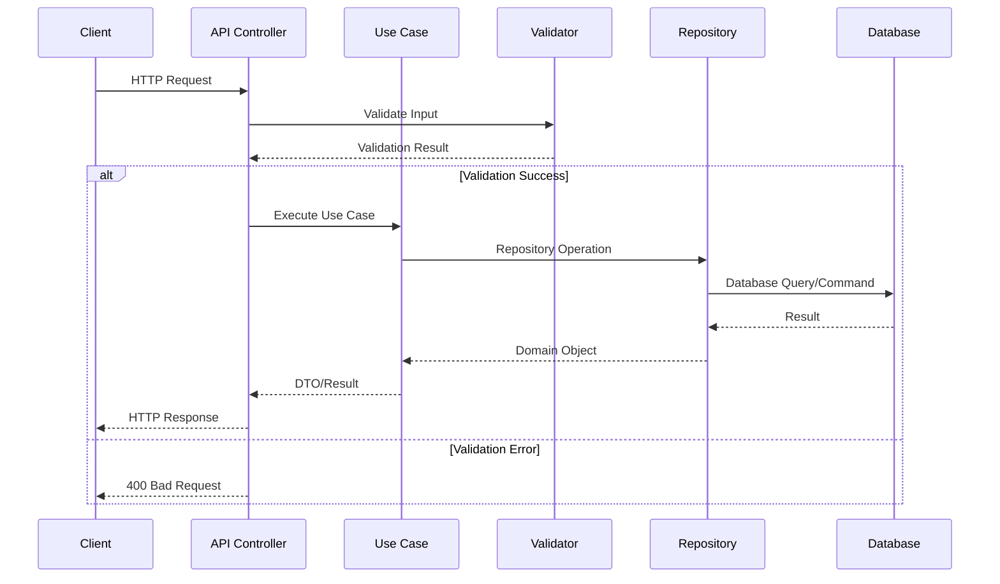

# Endpoints da API

## Estrutura dos Endpoints

```mermaid
graph LR
    subgraph "Customer Endpoints"
        POST_C[POST /customers]
        PUT_C[PUT /customers/{id}]
        GET_C[GET /customers/{id}]
        GET_CD[GET /customers/by-document/{document}]
        GET_CE[GET /customers/by-email/{email}]
    end

    subgraph "Affiliate Endpoints"
        POST_A[POST /affiliates]
        PUT_A[PUT /affiliates/{id}]
        GET_A[GET /affiliates/{id}]
    end

    subgraph "Event Endpoints"
        POST_E[POST /events]
        PUT_E[PUT /events/{id}]
        GET_E[GET /events/{id}]
    end

    subgraph "Sector Endpoints"
        POST_S[POST /sectors]
        PUT_S[PUT /sectors/{id}]
        GET_S[GET /sectors/{id}]
    end

    classDef get fill:#90EE90,stroke:#333,stroke-width:2px
    classDef post fill:#87CEEB,stroke:#333,stroke-width:2px
    classDef put fill:#FFB347,stroke:#333,stroke-width:2px

    class GET_C,GET_CD,GET_CE,GET_A,GET_E,GET_S get
    class POST_C,POST_A,POST_E,POST_S post
    class PUT_C,PUT_A,PUT_E,PUT_S put
```

## Fluxo de Requisição



## Exemplo de CRUD Completo (Customer)

```mermaid
graph TD
    subgraph "HTTP Methods"
        CREATE[POST /customers]
        READ[GET /customers/{id}]
        UPDATE[PUT /customers/{id}]
        SEARCH1[GET /customers/by-document/{document}]
        SEARCH2[GET /customers/by-email/{email}]
    end

    subgraph "Controllers"
        CC[CustomersController]
    end

    subgraph "Use Cases/Queries"
        CUC[CreateCustomerUseCase]
        UUC[UpdateCustomerUseCase]
        GQ[GetCustomerByIdQuery]
        GDQ[GetCustomerByDocumentQuery]
        GEQ[GetCustomerByEmailQuery]
    end

    CREATE --> CC
    READ --> CC
    UPDATE --> CC
    SEARCH1 --> CC
    SEARCH2 --> CC

    CC --> CUC
    CC --> UUC
    CC --> GQ
    CC --> GDQ
    CC --> GEQ

    classDef endpoint fill:#f9f,stroke:#333,stroke-width:2px
    classDef controller fill:#bbf,stroke:#333,stroke-width:2px
    classDef usecase fill:#bfb,stroke:#333,stroke-width:2px

    class CREATE,READ,UPDATE,SEARCH1,SEARCH2 endpoint
    class CC controller
    class CUC,UUC,GQ,GDQ,GEQ usecase
```