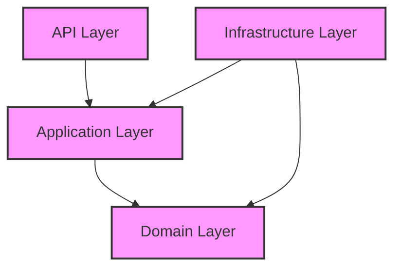
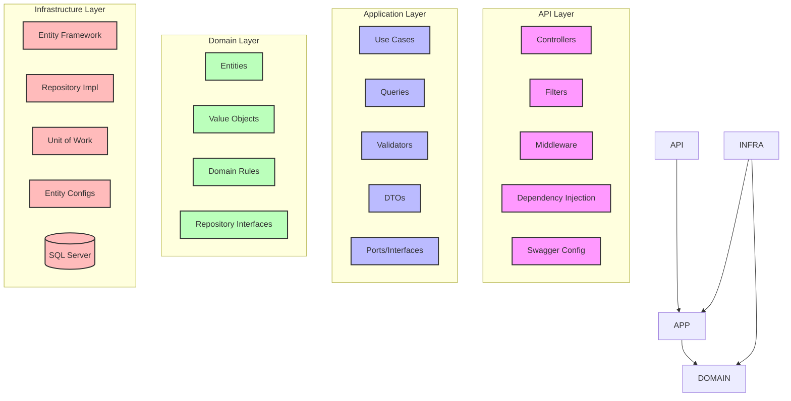

# Camadas da Arquitetura

## Visão Geral

```mermaid
graph TD
    API[API Layer]
    APP[Application Layer]
    DOMAIN[Domain Layer]
    INFRA[Infrastructure Layer]

    API --> APP
    APP --> DOMAIN
    INFRA --> APP
    INFRA --> DOMAIN

    classDef layer fill:#f9f,stroke:#333,stroke-width:2px
    class API,APP,DOMAIN,INFRA layer
```

## Estrutura Detalhada

```mermaid
graph TD
    subgraph "API Layer"
        CONT[Controllers]
        FILTER[Filters]
        MIDDLE[Middleware]
        DI[Dependency Injection]
        SWAGGER[Swagger Config]
    end

    subgraph "Application Layer"
        UC[Use Cases]
        QUERY[Queries]
        VAL[Validators]
        DTO[DTOs]
        PORT[Ports/Interfaces]
    end

    subgraph "Domain Layer"
        ENT[Entities]
        VO[Value Objects]
        RULE[Domain Rules]
        REPO[Repository Interfaces]
    end

    subgraph "Infrastructure Layer"
        EF[Entity Framework]
        REPOS[Repository Impl]
        UOW[Unit of Work]
        CONF[Entity Configs]
        SQL[(SQL Server)]
    end

    API --> APP
    APP --> DOMAIN
    INFRA --> DOMAIN
    INFRA --> APP

    classDef apiColor fill:#f9f,stroke:#333,stroke-width:2px
    classDef appColor fill:#bbf,stroke:#333,stroke-width:2px
    classDef domainColor fill:#bfb,stroke:#333,stroke-width:2px
    classDef infraColor fill:#fbb,stroke:#333,stroke-width:2px

    class CONT,FILTER,MIDDLE,DI,SWAGGER apiColor
    class UC,QUERY,VAL,DTO,PORT appColor
    class ENT,VO,RULE,REPO domainColor
    class EF,REPOS,UOW,CONF,SQL infraColor
```