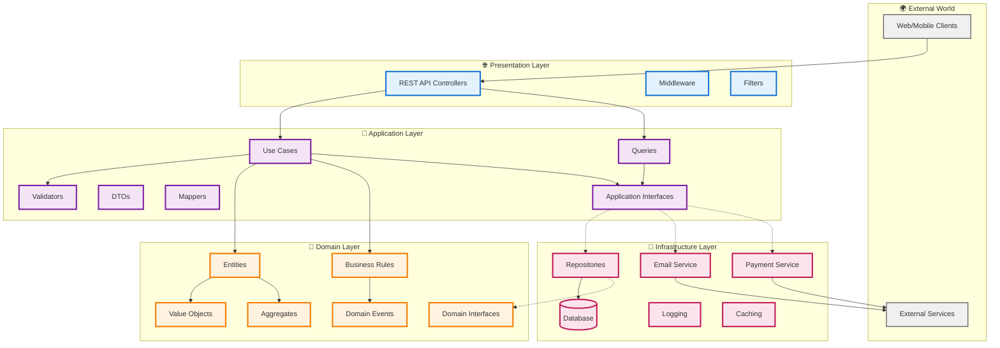
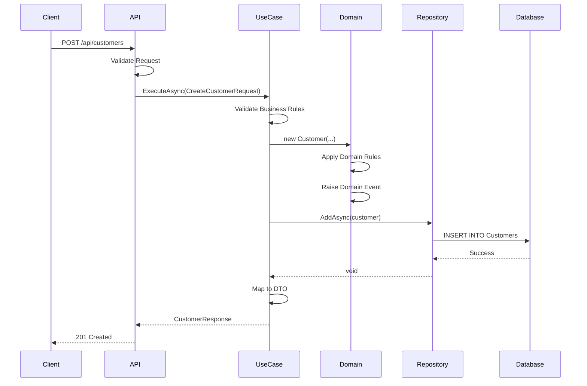

# 📐 Camadas da Arquitetura

<div align="center">


</div>

## 🎯 Visão Geral das Camadas

O VibraTicket implementa Clean Architecture com 4 camadas principais, cada uma com responsabilidades bem definidas:



## 🌐 1. Presentation Layer (API)

### Responsabilidades
- ✅ Receber requisições HTTP
- ✅ Validação básica de entrada
- ✅ Serialização/Deserialização
- ✅ Autenticação e Autorização
- ✅ Documentação (Swagger)
- ✅ Tratamento de exceções

### Componentes

```csharp
// 📁 Api/Controllers/CustomerController.cs
[ApiController]
[Route("api/[controller]")]
public class CustomerController : ControllerBase
{
    private readonly ICreateCustomerUseCase _createCustomer;
    private readonly IGetCustomerByIdQuery _getCustomer;

    [HttpPost]
    [ProducesResponseType(typeof(CustomerResponse), 201)]
    [ProducesResponseType(typeof(ErrorResponse), 400)]
    public async Task<IActionResult> Create(
        [FromBody] CreateCustomerRequest request)
    {
        var result = await _createCustomer.ExecuteAsync(request);
        return Created($"/api/customer/{result.Id}", result);
    }

    [HttpGet("{id:guid}")]
    [ProducesResponseType(typeof(CustomerResponse), 200)]
    [ProducesResponseType(404)]
    public async Task<IActionResult> GetById(Guid id)
    {
        var result = await _getCustomer.ExecuteAsync(id);
        return result != null ? Ok(result) : NotFound();
    }
}
```

### Estrutura de Pastas
```
📁 Api/
├── 📁 Controllers/        # Endpoints REST
├── 📁 Filters/           # Action Filters customizados
├── 📁 Middleware/        # Pipeline customizado
├── 📁 Configuration/     # Setup e DI
├── 📄 Program.cs        # Entry point
└── 📄 appsettings.json  # Configurações
```

## 💼 2. Application Layer

### Responsabilidades
- ✅ Orquestração de casos de uso
- ✅ Validação de regras de aplicação
- ✅ Mapeamento entre DTOs e Entidades
- ✅ Implementação de CQRS
- ✅ Transações de aplicação
- ✅ Logs de auditoria

### Use Cases (Commands)

```csharp
// 📁 Application/UseCases/Customer/CreateCustomerUseCase.cs
public class CreateCustomerUseCase : ICreateCustomerUseCase
{
    private readonly ICustomerRepository _repository;
    private readonly IUnitOfWork _unitOfWork;
    private readonly IValidator<CreateCustomerRequest> _validator;
    private readonly IMapper _mapper;

    public async Task<CustomerResponse> ExecuteAsync(
        CreateCustomerRequest request)
    {
        // 1️⃣ Validação
        await _validator.ValidateAndThrowAsync(request);

        // 2️⃣ Mapear para entidade
        var customer = _mapper.Map<Customer>(request);

        // 3️⃣ Aplicar regras de negócio
        customer.Activate();

        // 4️⃣ Persistir
        await _repository.AddAsync(customer);
        await _unitOfWork.CommitAsync();

        // 5️⃣ Retornar DTO
        return _mapper.Map<CustomerResponse>(customer);
    }
}
```

### Queries (CQRS)

```csharp
// 📁 Application/Queries/Customer/GetCustomerByDocumentQuery.cs
public class GetCustomerByDocumentQuery : IGetCustomerByDocumentQuery
{
    private readonly ICustomerReadRepository _repository;
    private readonly IMapper _mapper;

    public async Task<CustomerResponse?> ExecuteAsync(string document)
    {
        var customer = await _repository.GetByDocumentAsync(document);
        return customer != null 
            ? _mapper.Map<CustomerResponse>(customer) 
            : null;
    }
}
```

### Estrutura de Pastas
```
📁 Application/
├── 📁 UseCases/          # Comandos (escrita)
│   ├── 📁 Customer/
│   ├── 📁 Event/
│   └── 📁 Order/
├── 📁 Queries/           # Consultas (leitura)
│   ├── 📁 Customer/
│   └── 📁 Reports/
├── 📁 DTOs/              # Request/Response
├── 📁 Validators/        # FluentValidation
├── 📁 Mappers/          # AutoMapper profiles
└── 📁 Interfaces/       # Contratos
```

## 🎯 3. Domain Layer

### Responsabilidades
- ✅ Entidades e regras de negócio
- ✅ Value Objects imutáveis
- ✅ Aggregates e consistência
- ✅ Domain Events
- ✅ Especificações de negócio
- ✅ Interfaces de repositório

### Entidade Rica

```csharp
// 📁 Domain/Entities/Customer.cs
public class Customer : Entity, IAggregateRoot
{
    private readonly List<Order> _orders = new();

    public Name Name { get; private set; }
    public Email Email { get; private set; }
    public Document Document { get; private set; }
    public Phone Phone { get; private set; }
    public CustomerStatus Status { get; private set; }
    public IReadOnlyCollection<Order> Orders => _orders.AsReadOnly();

    protected Customer() { } // EF Core

    public Customer(Name name, Email email, Document document, Phone phone)
    {
        Name = name ?? throw new ArgumentNullException(nameof(name));
        Email = email ?? throw new ArgumentNullException(nameof(email));
        Document = document ?? throw new ArgumentNullException(nameof(document));
        Phone = phone ?? throw new ArgumentNullException(nameof(phone));
        Status = CustomerStatus.Pending;

        AddDomainEvent(new CustomerCreatedEvent(Id, email.Value));
    }

    public void Activate()
    {
        if (Status != CustomerStatus.Pending)
            throw new DomainException("Customer is not pending");

        Status = CustomerStatus.Active;
        AddDomainEvent(new CustomerActivatedEvent(Id));
    }

    public Order PlaceOrder(IEnumerable<OrderItem> items)
    {
        if (Status != CustomerStatus.Active)
            throw new DomainException("Only active customers can place orders");

        var order = new Order(this, items);
        _orders.Add(order);

        AddDomainEvent(new OrderPlacedEvent(order.Id, Id));
        return order;
    }
}
```

### Value Objects

```csharp
// 📁 Domain/ValueObjects/Email.cs
public class Email : ValueObject
{
    public string Value { get; }

    public Email(string value)
    {
        if (string.IsNullOrWhiteSpace(value))
            throw new DomainException("Email cannot be empty");

        if (!IsValid(value))
            throw new DomainException("Invalid email format");

        Value = value.ToLowerInvariant();
    }

    private static bool IsValid(string email)
    {
        return Regex.IsMatch(email, 
            @"^[^@\s]+@[^@\s]+\.[^@\s]+$", 
            RegexOptions.IgnoreCase);
    }

    protected override IEnumerable<object> GetEqualityComponents()
    {
        yield return Value;
    }
}
```

### Estrutura de Pastas
```
📁 Domain/
├── 📁 Entities/          # Entidades de negócio
├── 📁 ValueObjects/      # Objetos de valor
├── 📁 Aggregates/        # Raízes de agregado
├── 📁 Events/            # Eventos de domínio
├── 📁 Specifications/    # Regras complexas
├── 📁 Services/          # Serviços de domínio
├── 📁 Exceptions/        # Exceções de domínio
└── 📁 Interfaces/        # Contratos
```

## 🔧 4. Infrastructure Layer

### Responsabilidades
- ✅ Implementação de repositórios
- ✅ Configurações do Entity Framework
- ✅ Integração com serviços externos
- ✅ Logging e monitoramento
- ✅ Caching distribuído
- ✅ Messaging e eventos

### Repository Implementation

```csharp
// 📁 Infrastructure/Repositories/CustomerRepository.cs
public class CustomerRepository : ICustomerRepository
{
    private readonly AppDbContext _context;

    public CustomerRepository(AppDbContext context)
    {
        _context = context;
    }

    public async Task<Customer?> GetByIdAsync(Guid id)
    {
        return await _context.Customers
            .Include(c => c.Orders)
            .FirstOrDefaultAsync(c => c.Id == id);
    }

    public async Task<Customer?> GetByDocumentAsync(string document)
    {
        return await _context.Customers
            .FirstOrDefaultAsync(c => c.Document.Value == document);
    }

    public async Task AddAsync(Customer customer)
    {
        await _context.Customers.AddAsync(customer);
    }

    public void Update(Customer customer)
    {
        _context.Customers.Update(customer);
    }
}
```

### Entity Configuration

```csharp
// 📁 Infrastructure/Persistence/Configurations/CustomerConfiguration.cs
public class CustomerConfiguration : IEntityTypeConfiguration<Customer>
{
    public void Configure(EntityTypeBuilder<Customer> builder)
    {
        builder.ToTable("Customers");

        builder.HasKey(c => c.Id);

        builder.Property(c => c.Id)
            .ValueGeneratedNever();

        // Value Object configuration
        builder.OwnsOne(c => c.Name, name =>
        {
            name.Property(n => n.FirstName)
                .HasColumnName("FirstName")
                .HasMaxLength(100)
                .IsRequired();

            name.Property(n => n.LastName)
                .HasColumnName("LastName")
                .HasMaxLength(100)
                .IsRequired();
        });

        builder.OwnsOne(c => c.Email, email =>
        {
            email.Property(e => e.Value)
                .HasColumnName("Email")
                .HasMaxLength(255)
                .IsRequired();

            email.HasIndex(e => e.Value).IsUnique();
        });

        builder.OwnsOne(c => c.Document, doc =>
        {
            doc.Property(d => d.Value)
                .HasColumnName("Document")
                .HasMaxLength(14)
                .IsRequired();

            doc.HasIndex(d => d.Value).IsUnique();
        });

        // Relationships
        builder.HasMany(c => c.Orders)
            .WithOne(o => o.Customer)
            .HasForeignKey(o => o.CustomerId);
    }
}
```

### Estrutura de Pastas
```
📁 Infrastructure/
├── 📁 Persistence/       # EF Core
│   ├── 📁 Configurations/
│   ├── 📁 Migrations/
│   └── 📄 AppDbContext.cs
├── 📁 Repositories/      # Implementações
├── 📁 Services/          # Serviços externos
│   ├── 📁 Email/
│   ├── 📁 Payment/
│   └── 📁 Storage/
├── 📁 Logging/          # Serilog
└── 📁 Caching/          # Redis
```

## 🔄 Fluxo Entre Camadas



## 🎨 Boas Práticas por Camada

### Presentation Layer
- ✅ Controllers magros (thin controllers)
- ✅ Sem lógica de negócio
- ✅ Apenas coordenação
- ✅ Tratamento global de exceções

### Application Layer
- ✅ Casos de uso específicos
- ✅ Uma operação por classe
- ✅ Validação de entrada
- ✅ Orquestração sem lógica

### Domain Layer
- ✅ Rico em comportamentos
- ✅ Sempre válido (invariantes)
- ✅ Sem dependências externas
- ✅ Linguagem ubíqua

### Infrastructure Layer
- ✅ Detalhes de implementação
- ✅ Configurações específicas
- ✅ Adaptadores para externos
- ✅ Performance e otimização

---

<div align="center">

[← Arquitetura](./README.md) | [Próximo: Fluxo de Dados →](./data-flow.md)

</div>