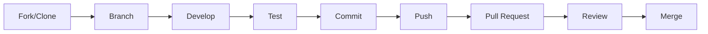

# 📚 Guias do VibraTicket

<div align="center">


</div>

## 📑 Guias Disponíveis

### 🚀 Começando

| Guia | Descrição |
|------|-----------|
| 📦 [**Guia de Instalação**](./installation.md) | Instruções detalhadas para configurar o ambiente |
| 🔧 [**Guia de Desenvolvimento**](./development.md) | Práticas e convenções para desenvolvedores |
| 🤝 [**Guia de Contribuição**](./contributing.md) | Como contribuir com o projeto |

### 🌐 Implantação

| Guia | Descrição |
|------|-----------|
| 🚢 [**Guia de Deploy**](./deployment.md) | Deploy em produção (Azure, AWS, On-premise) |
| 🐳 [**Docker & Kubernetes**](./docker-k8s.md) | Containerização e orquestração |
| ⚡ [**Performance & Scaling**](./performance.md) | Otimização e escalabilidade |

### 🔒 Segurança & Manutenção

| Guia | Descrição |
|------|-----------|
| 🔐 [**Guia de Segurança**](./security.md) | Práticas de segurança e hardening |
| 🔍 [**Troubleshooting**](./troubleshooting.md) | Solução de problemas comuns |
| 📊 [**Monitoramento**](./monitoring.md) | Configuração de logs e métricas |

## 🎯 Quick Start

### 1️⃣ Desenvolvimento Local

```bash
# Clone o repositório
git clone https://github.com/seu-usuario/vibraticket.git
cd vibraticket

# Configure o ambiente
cp appsettings.Development.template.json appsettings.Development.json

# Execute com Docker Compose
docker-compose up -d

# Ou execute localmente
dotnet run --project src/Api
```

### 2️⃣ Primeiros Passos

1. **Configuração Inicial**: Siga o [Guia de Instalação](./installation.md)
2. **Entenda a Arquitetura**: Leia sobre [Clean Architecture](../architecture/README.md)
3. **Explore a API**: Acesse `https://localhost:7001/swagger`
4. **Execute os Testes**: `dotnet test`

### 3️⃣ Fluxo de Desenvolvimento



## 📋 Checklist para Novos Desenvolvedores

- [ ] Leu o [README principal](../../README.md)
- [ ] Configurou o ambiente seguindo o [Guia de Instalação](./installation.md)
- [ ] Entendeu a [Arquitetura](../architecture/README.md)
- [ ] Leu o [Guia de Desenvolvimento](./development.md)
- [ ] Conhece as [Convenções de Código](./development.md#convenções-de-código)
- [ ] Sabe como [Executar os Testes](./development.md#testes)
- [ ] Entende o [Fluxo Git](./contributing.md#fluxo-git)

## 🛠️ Ferramentas Recomendadas

### IDEs
- **Visual Studio 2022**: IDE completa para .NET
- **Visual Studio Code**: Editor leve com extensões
- **JetBrains Rider**: IDE multiplataforma

### Extensões Úteis
- **C# Extension Pack**: Pacote completo para C#
- **GitLens**: Visualização avançada do Git
- **Docker Extension**: Gerenciamento de containers
- **Thunder Client**: Teste de APIs

### Ferramentas CLI
```bash
# .NET CLI
dotnet --version

# Entity Framework CLI
dotnet ef --version

# Docker
docker --version

# Git
git --version
```

## 📚 Recursos Adicionais

### Documentação Oficial
- [.NET Documentation](https://docs.microsoft.com/dotnet/)
- [Entity Framework Core](https://docs.microsoft.com/ef/core/)
- [Clean Architecture](https://blog.cleancoder.com/uncle-bob/2012/08/13/the-clean-architecture.html)

### Tutoriais
- [Building REST APIs with .NET](https://docs.microsoft.com/aspnet/core/web-api/)
- [CQRS Pattern](https://docs.microsoft.com/azure/architecture/patterns/cqrs)
- [Domain-Driven Design](https://martinfowler.com/tags/domain%20driven%20design.html)

### Comunidade
- [Stack Overflow - .NET](https://stackoverflow.com/questions/tagged/.net)
- [Reddit - r/dotnet](https://www.reddit.com/r/dotnet/)
- [.NET Foundation](https://dotnetfoundation.org/)

## 🆘 Precisa de Ajuda?

- 📧 **Email**: dev@vibraticket.com
- 💬 **Slack**: #vibraticket-dev
- 🐛 **Issues**: [GitHub Issues](https://github.com/seu-usuario/vibraticket/issues)
- 📖 **Wiki**: [Project Wiki](https://github.com/seu-usuario/vibraticket/wiki)

---

<div align="center">

[← Documentação](../README.md) | [Próximo: Instalação →](./installation.md)

</div>